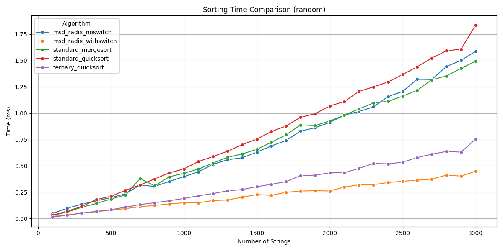
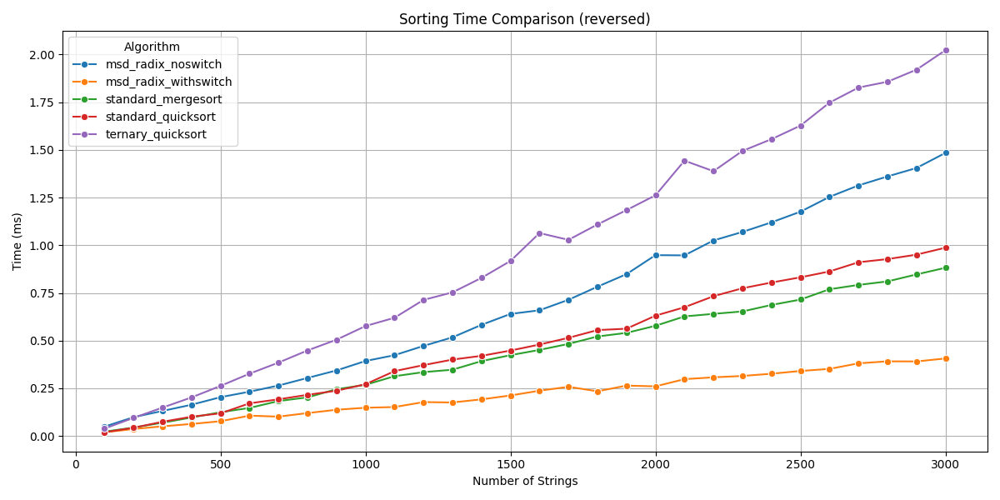
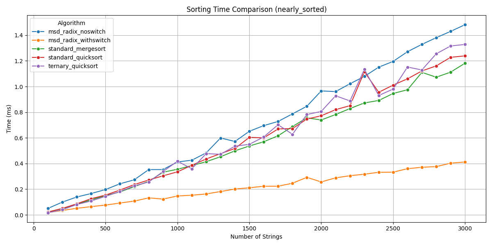
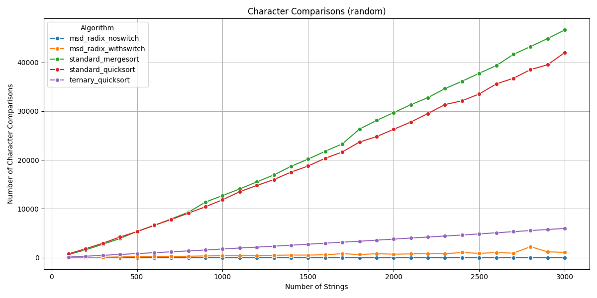
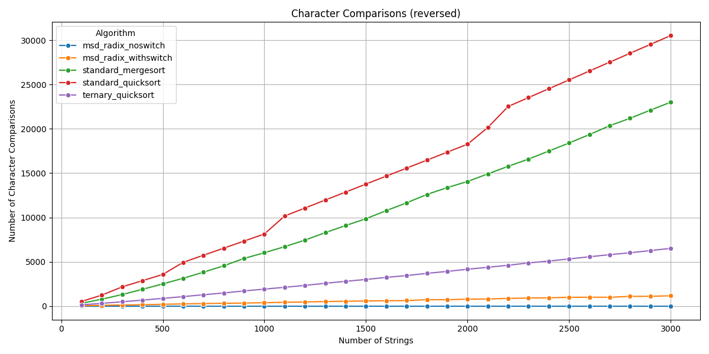
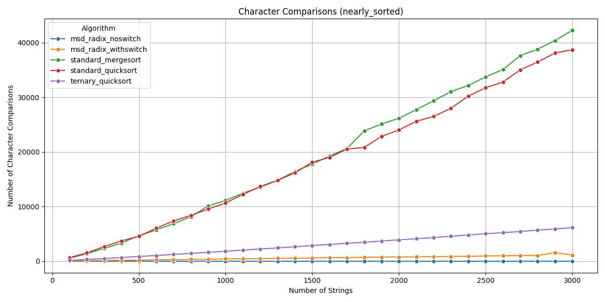

# Исследование эффективности алгоритмов сортировки строк

В данном исследовании были протестированы различные алгоритмы сортировки строк, включая **стандартные** и **специализированные**, разработанные для работы с лексикографическим порядком. Целью исследования являлось сравнение производительности этих алгоритмов по двум метриикам:

- **время выполнения (в миллисекундах)**
- **количество посимвольных сравнений**

Тестирование проводилось на трех типах входных данных:
1. **Случайные строки**
2. **Обратно отсортированные строки**
3. **Почти отсортированные строки**

Размеры тестовых массивов варьировались от 100 до 3000 строк с шагом 100.

## Тестируемые алгоритмы

Были реализованы следующие алгоритмы:

| Название алгоритма                 | Тип                  |
|------------------------------------|----------------------|
| `standard_quicksort`               | Стандартная QuickSort |
| `standard_mergesort`               | Стандартная MergeSort |
| `ternary_quicksort`                | Тернарная QuickSort   |
| `msd_radix_noswitch`               | MSD Radix Sort (без переключения) |
| `msd_radix_withswitch`             | MSD Radix Sort (с переключением) |

## Методология тестирования

Для каждого размера массива было проведено **5 прогонов** с усреднением результатов. Для генерации тестовых данных использовался класс `StringGenerator`, поддерживающий все три типа наборов.

Измеряемые метрики:
- **Время выполнения** — измерялось с помощью `std::chrono::high_resolution_clock`.
- **Количество посимвольных сравнений** — подсчитывалось при каждом сравнении символов в строках.

## Результаты

### Графики времени выполнения

#### 1. Случайные данные

MSD Radix Sort с переключением (msd_radix_withswitch) продемонстрировал наилучшую производительность по времени выполнения, особенно при больших объемах данных. Стандартная QuickSort (standard_quicksort) показала самые плохие результаты и её производительность заметно снижалась с увеличением размера массива. Это связано с тем, что она выполняет полное сравнение строк.

#### 2. Обратно отсортированные данные

На обратно отсортированных данных тернарная QuickSort показала самые плохие результаты, когда MSD Radix Sort стабильнее и быстрее всех, особенно на большом объеме данных.

#### 3. Почти отсортированные данные

Для почти отсортированных данных MSD Radix с переключением снова оказался самым быстрым, что указывает на его адаптивность к данным.

---

### Графики количества посимвольных сравнений

#### 1. Случайные данные

MSD Radix сокращает количество сравнений благодаря использованию префиксов.

#### 2. Обратно отсортированные данные

Стандартные алгоритмы требуют значительно большего числа сравнений, так как сравнивают строки целиком.

#### 3. Почти отсортированные данные

MSD Radix с переключением минимизирует число сравнений, используя преимущества частично упорядоченных данных.

## Сравнение с теоретическими оценками

### MSD Radix Sort (без переключения)

- **Теоретическая оценка:** O(n ⋅ L), где `L` — средняя длина строки  
- **Практические результаты:**
  - Линейная зависимость времени выполнения от размера массива и длины строк
  - Стабильная производительность на всех типах данных
  - Высокая эффективность при длинных строках благодаря посимвольной обработке без полного сравнения

### MSD Radix Sort (с переключением на тернарную QuickSort)

- **Теоретическая оценка:** O(n ⋅ L) в среднем случае  
- **Практические результаты:**
  - Гибридный подход показал **наилучшую производительность** среди всех алгоритмов
  - Благодаря переключению на тернарную QuickSort для малых подмассивов, удалось минимизировать издержки рекурсии
  - Алгоритм адаптивен к структуре входных данных:
    - Отлично справляется с почти отсортированными данными
    - Эффективен на случайных и обратно упорядоченных наборах
  - Минимизация посимвольных сравнений подтверждена эмпирически

### Тернарная QuickSort

- **Теоретическая оценка:** O(n ⋅ log n ⋅ L) в среднем случае  
- **Практические результаты:**
  - В среднем работает быстрее стандартной QuickSort за счёт использования трёхпутевого разбиения по одному символу
  - Чувствителен к выбору опорного элемента
  - Хорошо себя показывает на данных с общими префиксами
  - Наблюдается **квадратичная сложность** в худшем случае (например, на обратно отсортированных данных)
  - Значительно улучшает производительность на **почти отсортированных массивах**

### String Mergesort (с использованием длины наибольшего общего префикса, LCP)

- **Теоретическая оценка:** O(n ⋅ log n ⋅ L)  
- **Практические результаты:**
  - Время выполнения растёт логарифмически, что подтверждает теорию
  - Использование LCP значительно снижает количество посимвольных сравнений
  - Устойчивый алгоритм, но проигрывает MSD Radix по общей скорости
  - Хорош как альтернатива, если важна стабильность сортировки

### Standard QuickSort

- **Теоретическая оценка:** O(n ⋅ log n) — число операций сравнения  
- **Посимвольные сравнения:** O(n ⋅ log n ⋅ L)  
- **Практические результаты:**
  - Работает медленнее остальных из-за необходимости полного сравнения строк
  - Чувствителен к выбору опорного элемента
  - На больших объёмах данных заметно проигрывает специализированным алгоритмам
  - Подходит для простых задач, где не требуется минимизация символьных операций

### Standard MergeSort

- **Теоретическая оценка:** O(n ⋅ log n) — число операций сравнения  
- **Посимвольные сравнения:** O(n ⋅ log n ⋅ L)  
- **Практические результаты:**
  - Обладает предсказуемой скоростью работы, но требует больше памяти
  - Также сравнивает строки целиком, поэтому имеет высокую стоимость сравнений
  - Полезен, когда требуется сохранить порядок равных элементов

## Выводы

1. **MSD Radix Sort с переключением** показал **наилучшую производительность** на всех типах данных.
2. **Стандартные алгоритмы** (Quick и Merge) менее эффективны при работе со строками из-за необходимости посимвольного сравнения.
3. **Алгоритмы, учитывающие структуру строк** (тернарная QuickSort, MSD Radix), демонстрируют значительное преимущество при наличии общих префиксов.
4. **MSD Radix Sort с переключением** является наиболее универсальным и рекомендуется к использованию при сортировке строк в реальных задачах.

## Исходный код

## ID решений
- a1m: 321297352
- a1q: 321297424
- a1r: 321297872
- a1rq: 321298760